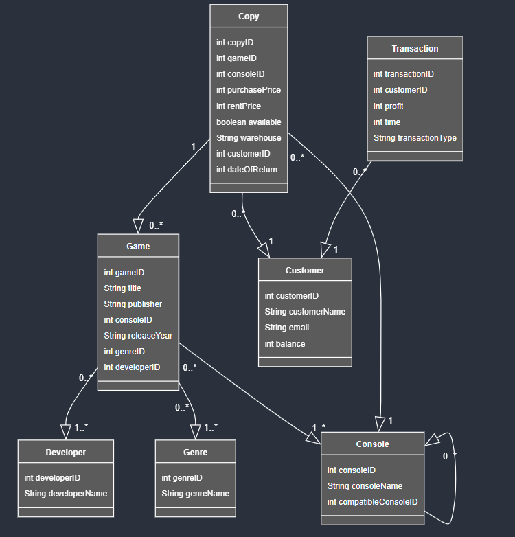

# databasesProject

# 1. Inleiding
De Video Game History Foundation (VGHF) is een non-profitorganisatie die is toegewijd aan het preserveren van video game gerelateerd materiaal. Ze verdeelt retro videogames over verschillende musea en warenhuizen waar de spellen tentoongesteld kunnen worden. Daarnaast maakt ze het ook mogelijk voor klanten om spellen uit te lenen zodat ze deze thuis kunnen ervaren. Bovendien verkoopt de organisatie spellen waarvan ze voldoende exemplaren bezitten.
In dit project wordt een gepaste database uitgebouwd voor de organisatie die het concept van uitlenen en verkopen mogelijk maakt. Data is omvat in zeven entiteiten: 
- Game
- Copy
- Customer
- Transaction
- developer
- Genre
- Console
 
De cijfers naast de pijlen in het schema verwijzen naar het soort relatie de entiteiten met elkaar hebben. Het cijfer geeft het minimum aantal entiteiten voor een relatie weer. Wanneer achter een cijfer “...*” staat, betekent dit “of meer”. Een voorbeeld is de relatie tussen game en developer. Deze relatie heeft een 0..* op 1..* relatie (nul of meer op een of meer). Dit betekent dat een game altijd minstens één developer heeft, maar er ook meerdere kan hebben. En een developer heeft mogelijk nul games op zijn naam staan, maar ook elk ander mogelijk aantal.

# 2. Entiteiten

## 2.1 Game
De entiteit 'Game' bewaart elke game die er beschikbaar is in de database, ze bezit een lijst van alle consoles waarop het spel uitgebracht is. Een game kan namelijk uitgebracht zijn op meerdere consoles. Vanuit de entiteit 'Copy' wordt dus ook gerefereerd naar de game. De (int) gameID is de specifieke ID voor een game. De (string) title is de titel van de game. De (int) consoleID bevat alle consoles waarop de game gespeeld kan worden. Ook oudere en nieuwere consoles die compatibel zijn worden weergegeven. De property (string) releaseYear is het jaar van uitgave van de game. De (int) genreID is het genre van de game, een game kan meerdere genres bevatten. De (int) developerID is de specifieke ID voor de developer. PublisherName (String) is de naam van de uitgever. 

## 2.2 Copy
De entiteit 'Copy' is een entiteit die een enkel exemplaar van een game voorstelt, met de console waarvoor deze versie gemaakt is. Dit exemplaar bestaat fysiek. De properties wijzen op de status van dat enkele exemplaar. De (int) gameID verwijst naar de properties van het spel zelf, de properties van de game zijn eigenschappen die elke copy gemeenschappelijk heeft. Zo wordt minder identieke data meerdere keren toegevoegd waardoor de database minder gevoelig wordt voor fouten. De (int) copyID is een specifieke ID voor elk fysiek exemplaar de VGHF heeft. De (int) consoleID is de ID die weergeeft voor welke console de game uitgebracht is. De ID toont de console die vermeld staat op de verpakking van de game. De (int) purchasePrice is de prijs om die kopie te kopen. De (int) rentPrice is de prijs om de game te huren. De (boolean) available geeft een antwoord of de kopie op dit moment beschikbaar is. De (string) property warehouse is een naam van het warehouse waar de copy verkrijgbaar is. De (int) customerID is een specifieke ID voor de customer die de copy heeft uitgeleend. De dateOfReturn (int) is de datum tot wanneer de copy uitgeleend is. Als deze waarde ‘0’ is, is de kopie beschikbaar, en bij verkochte kopieën is deze waarde gelijk aan ‘-1’. 

## 2.3 Customer
De entiteit ‘Customer’ geeft aan wie de koper, uitlener of donator is van een item. Dit is dus de data van een account in de VGHF database. De properties geven meer inzicht in wie deze customer is. De (int) customerID is een specifieke ID voor elke customer. De (string) customerName is de voornaam van de customer, samen met de (string) email is een customer dus herkenbaar en bereikbaar. De property (int) balance is het tegoed dat deze customer heeft voor het huren of kopen van games. Balance kan ook een negatieve waarde hebben, de customer zal dan schulden hebben.

## 2.4 Transaction
De ‘Transaction’ entiteit geeft een overzicht van alle transacties die gebeuren bij VGHF. Een transactie kan zowel de huur zijn van een game als een donatie of een verkochte game. Deze lijst bevat zowel de donaties als de inkomsten dankzij huur of verkoop. De (int) transactionID is een specifieke ID voor de transactie. De property (int) profit drukt uit hoeveel winst of verlies de transactie met zich meebrengt. De transaction type (String) geeft extra informatie over de reden van de transaction. Time (int) is het ogenblik waarop de transactie plaatsvond.

## 2.5 developer
De entiteit 'developer' voorziet de developers/publisher die de game heeft uitgebracht. De (int) developerID is een specifieke ID voor de developer of developer van de game. De (string) developerName is de proportie die de naam van de developer bijhoudt.

## 2.6 Genre
Het 'Genre' is een specifieke categorie games die verband houden met vergelijkbare gameplay-kenmerken. De entiteit genre bevat een (int) genreID die specifiek is voor elk genre. Elk genre heeft een (string) genreName die een naam geeft aan het specifieke genre.

## 2.7 Console
'Console' is een entiteit die weergeeft op welke console de game speelbaar is. De (int) consoleID geeft de specifieke ID voor de console. De (int) compatibleConsoleID is een specifieke ID voor de consoles waarop de game kan worden gespeeld. De property (string) consoleName geeft de naam van de console. 

# 3. Verbanden
De VGHF kan beschikken over meerdere exemplaren van hetzelfde spel, die ieder individueel uitgeleend of verkocht kunnen worden. Hiervoor refereren ‘Copy’ entiteiten naar de entiteit ‘Game’, hierbij bevat ‘Copy’ informatie specifiek over één specifiek exemplaar van het spel opgeslagen in een van de warenhuizen. Deze informatie bevat bijvoorbeeld wie het exemplaar heeft uitgeleend en voor welke console deze kopie gemaakt is. Terwijl ‘Game’ informatie bevat die hetzelfde is voor alle exemplaren van het spel, zoals zijn genre en de makers van het spel. Op die manier wordt het kopiëren van data zo veel mogelijk vermeden. Het ingeven van nieuwe kopieën zou hierdoor ook vlotter verlopen en de kans op menselijke fouten wordt kleiner. 
‘Copies’ verwijzen naar de ‘Customer’ entiteit en naar de specifieke console waarop ze werken. Die console entiteit verwijst zelf ook naar andere console entiteiten, dat zijn (nieuwere) consoles die ‘backwards compatible’ zijn met hun vorige generatie, en de spellen van deze console ook kunnen spelen. Zo zouden de Nintendo DS en DS Lite vermeld worden bij de Nintendo GBA. 
Tussen de ‘Game’ en ‘developer’ entiteiten is er een veel op veel relatie: een developer kan meerdere spellen ontwikkelen en een spel kan een samenwerking zijn van verschillende developers. Dezelfde relatie bestaat tussen ‘Game’ en ‘Genre’. 
Ook tussen de ‘Game’ en ‘Console’ entiteiten bestaat er een veel op veel relatie: een game kan voor verschillende consoles uitgebracht zijn en een console kan natuurlijk verschillende games spelen. Tenslotte bevat de ‘Transaction’ entiteit een verwijzing naar de customer die deze transactie gemaakt heeft.

